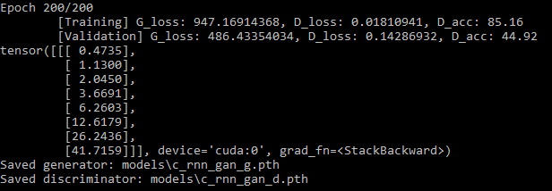

# AI Music Generation

## Introduction

This repository contains four models for generating music trained on midi files: C-RNN-GAN, GPT, LSTM, and CNN. Each model was trained on midi files from the Maestro v2.0.0 dataset, contained in ./data/. Instructions for running each model can be found in their respective sections below.

## C-RNN-GAN

### Overview

The original implementation of this model was developed by Olof Mogren in TensorFlow and can be found [here](https://github.com/olofmogren/c-rnn-gan). A PyTorch version of this project was then created here by CJ Bayron [here](https://github.com/cjbayron). (In a nutshell, C-RNN-GAN is a GAN variant where both the Generator and the Discriminator are RNNs, with each output at each timestep from the Generator correspondingly fed into each timestep as input to the Discriminator. The goal is to train the Generator to output structured sequences, such as MIDI music which was used in the paper. If you'd like to know more, head over to this [link](http://mogren.one/publications/2016/c-rnn-gan/) or read the [paper](http://mogren.one/publications/2016/c-rnn-gan/mogren2016crnngan.pdf).

We started with Bayron's model and tweaked it to use the Maestro Dataset. 

### Setup

Install the following packages with pip:

```
pip install torch
pip install pandas
pip install git+https://github.com/vishnubob/python-midi@feature/python3
```

Note: do not install midi via `pip install py-midi`. This will result in `AttributeError: module 'midi' has no attribute 'Pattern'` when training. The last `pip install` line above installs directly from git which should not produce this error.

### Status

The implementation can work well on simple sequences such as `a(n+1) = 2*a(n)`, where each element is twice of the previous. You can try this by executing:
```
$ python train_simple.py
```
This runs for 200 epochs, after which you should get something similar to this:



When fed with MIDI data, training of this C-RNN-GAN implementation tends to be unstable. A lot of hyperparameter tweaking and training techniques such as freezing have been implemented, in which I managed to generate some convincing MIDI music, but not reproducible even while using the same set of hyperparameters and techniques. Nevertheless, I'll share these runs:

```
$ python train.py --g_lrn_rate=0.0001 --d_lrn_rate=0.0004 --g_pretraining_epochs=10 --d_pretraining_epochs=10 --label_smoothing
```
* Adam optimizer for both G and D, with learning rates 0.0001 and 0.0004, respectively
* Pre-trains G and D independently for 10 epochs i.e. Train G for 10 epochs with D frozen & vice versa
* Use label smoothing on real data i.e. use 0.9 as label instead of 1.0
* Output: [sample1.mid](samples/sample1.mid)

```
$ python train.py --use_sgd --g_lrn_rate=0.01 --d_lrn_rate=0.005 --label_smoothing --feature_matching
```
* SGD optimizer for both G and D, with learning rates 0.01 and 0.005, respectively
* Pre-trains G and D independently for 5 epochs (default)
* Use label smoothing
* Use feature matching for G loss (refer to [paper](http://mogren.one/publications/2016/c-rnn-gan/mogren2016crnngan.pdf) for more info)
* Output: [sample2.mid](samples/sample2.mid)

Additional flags to use:
new flags:
* `--data_dir`: takes 1 argument which is path to dataset containing a csv (if this flag is left out, it defaults to data/maestro-v2.0.0)

* `--composers`: takes at least 1 argument (separated by spaces) of composer names to train on. Must match exactly what is written in csv 'canonical_composer' column (if this flag is left out, it defaults to training all composers)

* `--redo_split`: takes no arguments; tells model to recreate test, validation, and training splits and process again. Without this flag, the model will look for a saved and processed songs variable in the [data_dir]/saved_variables/ directory. If no composers are specified with --composers, the songs variable will be restored from 'all_composers.txt'. If [num] composers are specified, it will be restored from [num] composers.txt.
Ex: use `--redo_split` if after training on Composer A, you decide to train on Composer B, as otherwise the model will restore from 1_composers.txt which would be saved from training on Composer A.

### Prerequisites

* Python 3.6
* PyTorch
* [python3-midi](https://github.com/louisabraham/python3-midi)

### License

This project is licensed under the Apache License, Version 2.0 - see the [LICENSE](LICENSE) file for details


## GPT

### Overview
The GPT implemented received a sequence of integer note values and learn the inherent structures of the notes.
### Running The Model

This project can be run by running all cells in GPT.ipynb


## LSTM

### Overview 
The LSTM implemented looked at the notes values of a sequence of lenth 20 and predict the next note.
### Running The Model

This project can be run by running all cells in LSTM.ipynb

## CNN

### Overview 

This is a CNN model looks at sequences of twenty pitch values to predict the next pitch value. It consists of 2 Conv1d layers followed by 3 fully-connected layers, ReLU, and Dropout. There is a final fully-connected layer which outputs the next pitch value prediction.

### Running The Model

This project can be run by running all cells in CNN.ipynb
